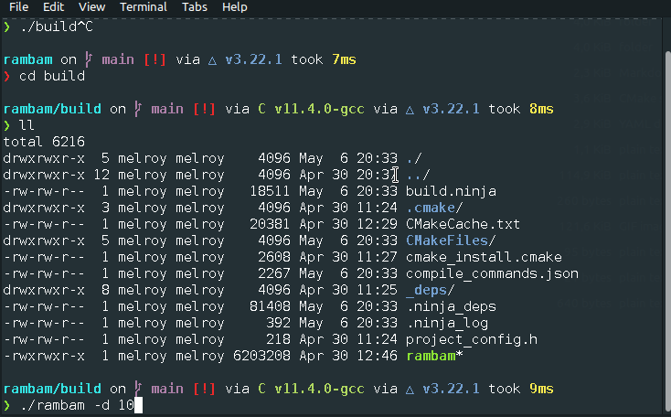

# RamBam

RamBam is a stress-test for API/web app/website, using massive parallel HTTP requests (Soon: Triggered remotely).  
RamBam is written in C++ and using a [Asio](https://think-async.com/Asio/) (also written in C++).

## Demo



## Download

[Download the latest release](https://gitlab.melroy.org/melroy/rambam/-/releases).

## Usage

Help: `rambam -h`

Usage (_default:_ Number of Requests GET Test of "_just_" 100 requests):

```bash
rambam domain.tld
```

Increase the default **request count** from 100 to 10.000 requests (`-r` for requests):

```bash
rambam -r 10000 https://domain.tld
```

Using the **duration test** for 10 seconds (`-d` for duration):

```bash
rambam -d 10 https://domain.tld
```

Example using **Post requests** (`-p` for **JSON** Post data):

```bash
rambam -p '{"username": "melroy"}' https://domain.tld/api/v1/user/create
```

More advanced parameters (`-v` for verbose output, `--debug` for additional TLS debug information):

```bash
rambam -v --debug https://domain.tld
```

You can use multiple parameters together, except the `-d` for duration test (in seconds) and `-r` for request test (total requests). Just pick one of the two different tests.

## Developers

### Requirements

- C++ Compiler (`sudo apt install build-essential` for GNU compiler, _Clang is **also** supported_)
- CMake (`sudo apt install cmake`)
- OpenSSL (`sudo apt install libssl-dev openssl`)
- Ninja build system (optional, but **recommended**: `sudo apt install ninja-build`)
- Ccache (optional, but much **recommended**: `sudo apt install ccache`)

### Build

Building the RamBam binary is very easy:

```bash
# Configure build folder (prepare)
cmake -B build
# Build it! Using make
cmake --build ./build -j 8 --config Release --target rambam
```

Binary is now located at: `build/rambam`.

# Notes

- The 'Number of Requests test' is faster than the 'Duration test', because duration test needs to check the current time passed.
- Enable debug output via: `--debug` flag.
- If you have a self-signed certificate try to use `-o` flag to override verifcation or disable peer certificate verification using: `--disable-peer-verify` flag.
- Silent all output via : `-s` flag.
- We don't support `transfer-encoding: chunked` (only possible with HTTP 1.1), hence we use only HTTP 1.0 requests.
